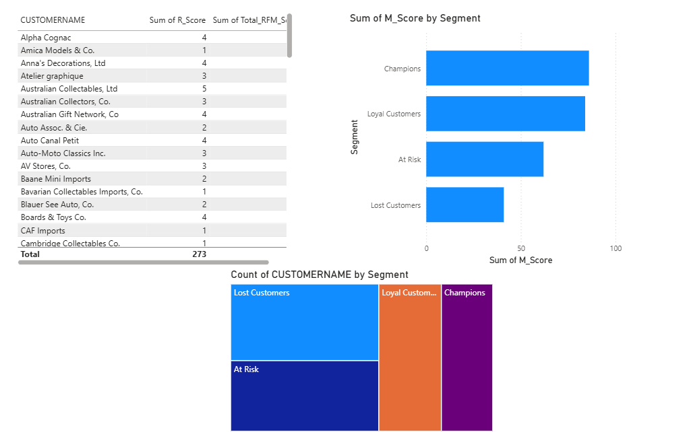

# Customer Segmentation using RFM Analysis (SQL & PBI)

## Επισκόπηση
Ανάλυση βάσης δεδομένων 92 πελατών με τη μέθοδο RFM (Recency, Frequency, Monetary) για τον εντοπισμό των πιο πιστών πελατών και αυτών που κινδυνεύουν να αποχωρήσουν.

## Διαδικασία
1. **SQL Scoring:** Χρήση της συνάρτησης `NTILE(5)` στην SQL για τη βαθμολόγηση των πελατών από το 1 έως το 5 σε τρεις άξονες.
2. **Data Transformation:** Υπολογισμός του Recency με βάση την τελευταία ημερομηνία αγοράς στο dataset.
3. **Power BI Visualization:** - **Treemap:** Οπτικοποίηση των segments (Champions, Loyal, At Risk, Lost).
   - **DAX Categorization:** Δημιουργία δυναμικών κατηγοριών βάσει του Total RFM Score.

## Βασικά Συμπεράσματα
- **Champions:** Μια μικρή ομάδα 7 πελατών (π.χ. Euro Shopping Channel) φέρνει το δυσανάλογα μεγαλύτερο μέρος των εσόδων.
- **Churn Alert:** Το μεγαλύτερο segment είναι οι "Lost Customers", υποδεικνύοντας ανάγκη για νέα στρατηγική retention.
- **Opportunities:** Οι "At Risk" πελάτες αναγνωρίστηκαν ονομαστικά για άμεση δράση από το marketing (πχ. καμπάνιες επαναπροσέγγισης).

## Screenshots
